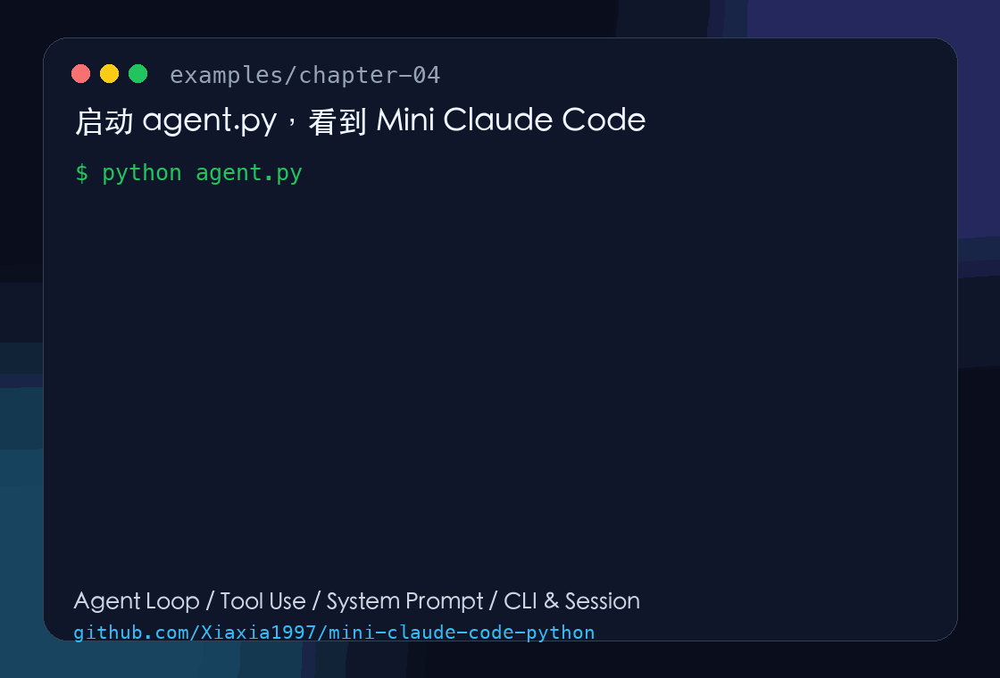

<div align="center">

# Build Your Own Mini Claude Code in Python

**Reading another Claude Code breakdown helps. Rebuilding the core loop yourself hits different.**

[中文](./README.md) · [English](./README_EN.md)

[](https://www.python.org/)
[](https://api-docs.deepseek.com/guides/anthropic_api)
[](./chapters/07-context.md)
[](./LICENSE)

[Start with Chapter 1](./chapters/01-agent-loop.md) ·
[Browse the examples](./examples/) ·
[Source & credits](#source--credits)



</div>

---

**How does a Claude Code style coding agent actually work?**

This project rebuilds the core ideas in small Python chapters, without LangChain, LangGraph, or any agent framework.

```text
conversation history -> tool use -> session restore -> streaming -> permissions
                     -> context compaction -> memory -> skills -> sub-agents -> MCP
```

The goal is not to clone the product. The goal is to make the architecture feel obvious by writing the smallest useful version yourself.

Full Chinese tutorials are available now. English chapter notes will be added gradually, but the code and the structure are already readable from this landing page.

## Why this exists

Most coding-agent articles are either high-level diagrams or very large codebases. Both are useful, but they leave a gap:

- you know an agent calls tools, but not what the message history looks like;
- you know it has a system prompt, but not how project rules enter the prompt;
- you know sessions can resume, but not what needs to be saved;
- you know Claude Code feels powerful, but not which pieces make that possible.

This repository turns those pieces into a step-by-step Python build.

## What works now

The current `main` branch follows the tutorial chapter by chapter:

- ✅ **Chapter 1 · Agent Loop**  
  Multi-turn messages, API calls, message history, and filtering non-text thinking blocks.  
  [Read tutorial](./chapters/01-agent-loop.md) · [View `agent.py`](./examples/chapter-01/agent.py)

- ✅ **Chapter 2 · Tools**  
  A minimal `read_file` tool, tool result messages, and the two-layer agent loop.  
  [Read tutorial](./chapters/02-tools.md) · [View `agent.py`](./examples/chapter-02/agent.py) · [View `tools.py`](./examples/chapter-02/tools.py)

- ✅ **Chapter 3 · System Prompt**  
  Static rules, runtime context, `CLAUDE.md` project instructions, and Git context.  
  [Read tutorial](./chapters/03-system-prompt.md) · [View `prompt.py`](./examples/chapter-03/prompt.py) · [View `agent.py`](./examples/chapter-03/agent.py)

- ✅ **Chapter 4 · CLI & Session**  
  Async agent class, REPL commands, session persistence, and `--resume`.  
  [Read tutorial](./chapters/04-cli-session.md) · [View `agent.py`](./examples/chapter-04/agent.py) · [View `session.py`](./examples/chapter-04/session.py) · [View `ui.py`](./examples/chapter-04/ui.py)

- ✅ **Chapter 5 · Streaming**<br>
  Streaming text output, spinner feedback, and retry for transient API failures.<br>
  [Read tutorial](./chapters/05-streaming.md) · [View `agent.py`](./examples/chapter-05/agent.py) · [View `ui.py`](./examples/chapter-05/ui.py)

- ✅ **Chapter 6 · Permissions**<br>
  Dangerous command detection, user confirmation, per-session approval memory, and read-before-edit protection.<br>
  [Read tutorial](./chapters/06-permissions.md) · [View `agent.py`](./examples/chapter-06/agent.py) · [View `tools.py`](./examples/chapter-06/tools.py)

- ✅ **Chapter 7 · Context**<br>
  Context compression, microcompact, stale tool-result snipping, and manual `/compact`.<br>
  [Read tutorial](./chapters/07-context.md) · [View `agent.py`](./examples/chapter-07/agent.py) · [View `tools.py`](./examples/chapter-07/tools.py)

```bash
> my name is Ming
Hello, Ming!

> what is my name?
Your name is Ming.
```

The model did not magically gain memory. The program simply sends the full `messages` history back on every turn. That is the first layer of context in a coding agent.

## Low-cost API option

You do not need to start with an Anthropic API bill just to learn the message flow.

DeepSeek provides an Anthropic-compatible API surface, so this project can use the Anthropic Python SDK with a different `base_url` and API key. That makes it much cheaper to experiment with agent loops, tool calls, and session logic before you decide whether to test against Claude models directly.

Compatibility does not mean the model behavior is identical to Claude Code. It is mainly a practical way to lower the learning and debugging cost.

[DeepSeek Anthropic API docs](https://api-docs.deepseek.com/guides/anthropic_api) ·
[DeepSeek pricing](https://api-docs.deepseek.com/quick_start/pricing)

## Learning roadmap

| Chapter | Core question | Status |
|---|---|:---:|
| [01 · Agent Loop](./chapters/01-agent-loop.md) | Why can multi-turn chat remember previous context? | ✅ |
| [02 · Tools](./chapters/02-tools.md) | How does a model move from “talking” to “doing”? | ✅ |
| [03 · System Prompt](./chapters/03-system-prompt.md) | How does an agent know its role, rules, and working directory? | ✅ |
| [04 · CLI & Session](./chapters/04-cli-session.md) | How can a conversation be saved, resumed, and interrupted? | ✅ |
| [05 · Streaming](./chapters/05-streaming.md) | How can output stream while work is still happening? | ✅ |
| [06 · Permissions](./chapters/06-permissions.md) | How do we stop an agent from doing dangerous things freely? | ✅ |
| [07 · Context](./chapters/07-context.md) | What happens when the message history becomes too long? | ✅ |
| 08 · Memory | What should survive across sessions? | Planned |
| 09 · Skills | How can reusable workflows be loaded only when needed? | Planned |
| 10 · Plan Mode | How can the agent plan without editing files? | Planned |
| 11 · Sub-Agent | How can work be split while keeping context isolated? | Planned |
| 12 · MCP | How can the agent connect to external tool servers? | Planned |

Each completed milestone is also tagged:

- [`v0.1-agent-loop`](https://github.com/Xiaxia1997/mini-claude-code-python/tree/v0.1-agent-loop)
- [`v0.2-tools`](https://github.com/Xiaxia1997/mini-claude-code-python/tree/v0.2-tools)
- [`v0.3-system-prompt`](https://github.com/Xiaxia1997/mini-claude-code-python/tree/v0.3-system-prompt)
- [`v0.4-cli-session`](https://github.com/Xiaxia1997/mini-claude-code-python/tree/v0.4-cli-session)
- [`v0.5-streaming`](https://github.com/Xiaxia1997/mini-claude-code-python/tree/v0.5-streaming)
- [`v0.6-permissions`](https://github.com/Xiaxia1997/mini-claude-code-python/tree/v0.6-permissions)
- [`v0.7-context`](https://github.com/Xiaxia1997/mini-claude-code-python/tree/v0.7-context)
- [`v0.6-permissions-r2`](https://github.com/Xiaxia1997/mini-claude-code-python/tree/v0.6-permissions-r2)
- [`v0.7-context-r2`](https://github.com/Xiaxia1997/mini-claude-code-python/tree/v0.7-context-r2)

## Quick start

Requirements:

- Python 3.11+
- a DeepSeek API key or another Anthropic-compatible endpoint

```bash
git clone https://github.com/Xiaxia1997/mini-claude-code-python.git
cd mini-claude-code-python

python3.12 -m venv .venv
source .venv/bin/activate
pip install -e .

export DEEPSEEK_API_KEY="your-api-key"
cd examples/chapter-07
python agent.py
```

Resume the last session:

```bash
python agent.py --resume
```

## Who this is for

This is for developers who want to understand coding agents by building one, especially if “just read the source” feels too vague.

You will probably enjoy it if you care about:

- Claude Code style agent architecture;
- tool calling and local tool execution;
- context and session design;
- building useful AI systems without hiding everything behind a framework.

## What this is not

This is not an official Claude Code implementation, not a production-ready coding agent, and not a replacement for the real product.

It is a learning project: small enough to read, real enough to run, and structured enough to grow chapter by chapter.

## Source & credits

This project is inspired by [claude-code-from-scratch](https://github.com/Windy3f3f3f3f/claude-code-from-scratch) by [@Windy3f3f3f3f](https://github.com/Windy3f3f3f3f).

The original project is an excellent source-level tutorial on the core architecture behind Claude Code-like agents. This repository keeps the attribution, rewrites the learning path in a smaller Python-first form, and adds chapter-by-chapter notes and runnable examples.

## License

MIT. See [LICENSE](./LICENSE).
